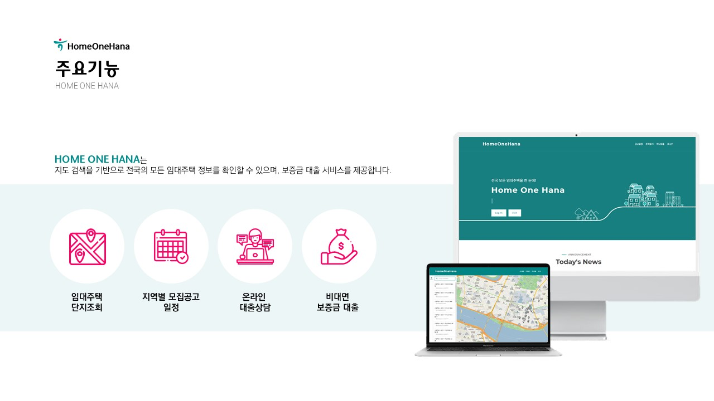
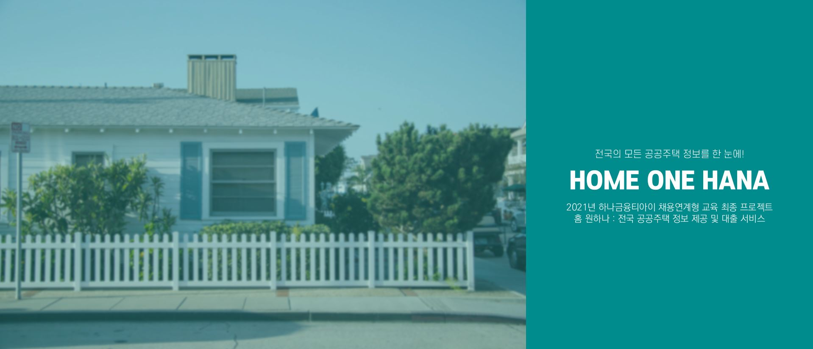
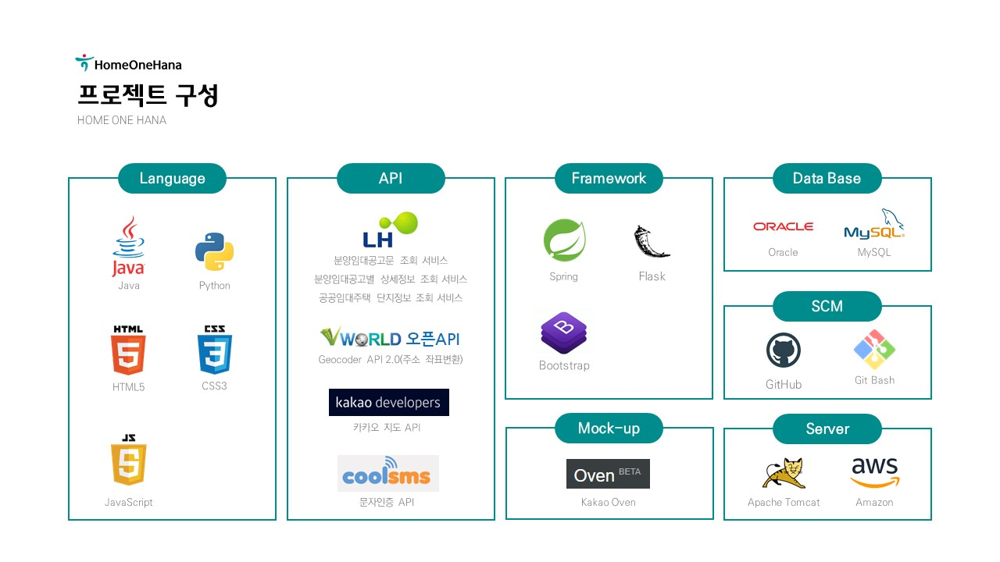
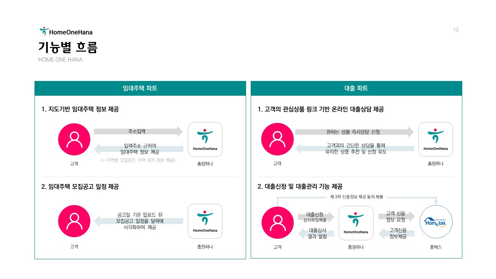
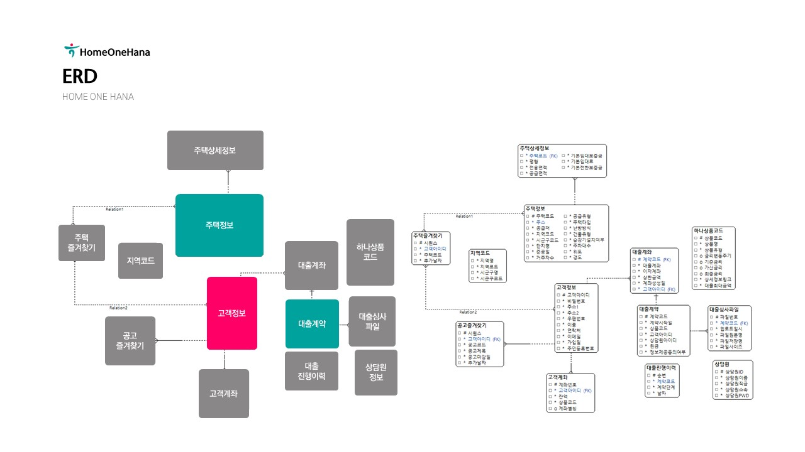
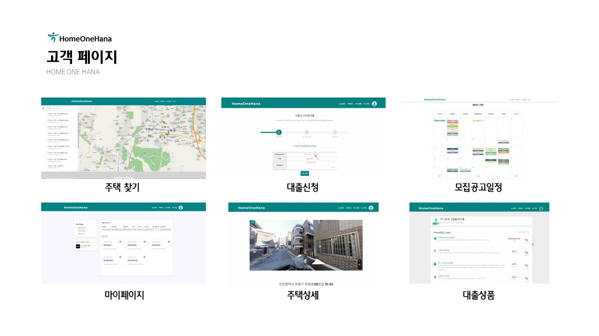
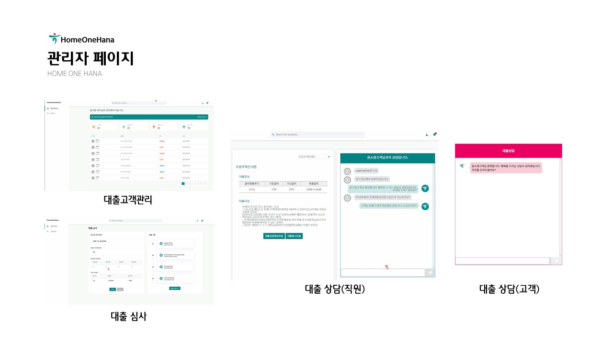

# 홈 원하나 : 전국 임대주택 정보 제공 및 대출 서비스

[프로젝트 홈페이지 - https://koposoftware.github.io/2021_10_syyoon/](https://koposoftware.github.io/2021_10_syyoon/)

# 1. 프로젝트 개요

한국주택토지공사에서 공급하는 임대주택의 공급량은 매년 증가하고 있으며, 2022년까지 13.6호 사업이 승인될 예정입니다. 임대주택은 주변 시세보다 저렴한 임대료로 주택을 공급하고 있습니다. 인해 실제 잠실 행복주택의 경우 1400:1의 경쟁률을 기록했을 정도로 초기 자본력이 부족한 청년층의 많은 관심을 받고 있습니다. 

 

청년 고객층을 확보하기 위해 임대주택의 공급처인 LH의 청약 홈의 UI를 개선하고, 대출까지 제공하는 `홈 원하나` 웹 서비스 개발을 기획하였습니다.
  

 

   

# 2. 프로젝트 구성

   [프로젝트 주제 제안서 다운로드](/윤소영-홈원하나 프로젝트제안서.pdf)   
    
    
    
    
   
    
 
# 3. 프로젝트 결과
    
    

   

## 발표 ppt 
   [발표자료 다운로드](/윤소영-홈원하나 발표제안서.pdf) 

   

## 시연 동영상 
   

   

# 5. 본인 소개
| 항목 | 내용 | - |
|:---:|:---:|:---|
| **이름** |윤소영||
| **연락처** | soyo1228@naver.com| [깃블로그](https://yoon-ddo.github.io/) |
| **skill set** | | Frontend - HTML, CSS, Javascript |
| | | Backend - Java, Python |
| | | DataBase - Oracle |
| **자격증** | 2021.06 | 정보처리기사 ( 한국산업인력공단 ) |
|| 2020.06 | SQLD ( 한국데이터산업진흥원 ) |
|| 2020.07 | ADsP ( 한국데이터산업진흥원 ) |
| **수상** | 2020.08 ~ 2020.09 | BIG CONTEST Innovation 분야 코로나 시대의 언택트 소통 클래스 Kids Social Connector(본선진출) |
|| 2020.07 ~ 2020.08 | 비정형데이터를 이용한 스타트업 투자예측(최우수상) |
|| 2020.02 ~ 2020.02 | 소셜데이터를 활용한 음식 트랜드 분석(금상) |
| **교육이력** | 2021.03 ~ 2021.12 | 하나금융티아이 채용전환형 교육 1200시간( 한국폴리텍대학교 광명융합기술교육원 - 데이터분석과 ) |
|| 2020.04 ~ 2020.08 | 실시간 빅데이터 분석 및 시각 인지 시스템 개발자 양성과정 840시간( 한국소프트웨어산업협회 ) |
|| 2019.12 ~ 2020.02 | 청년취업아카데미 핀테크_빅데이터 금융 사이언티스트 양성과정 500시간( 아시아경제 ) |
| **이력** |  2020.09 ~ 2020.12 | [서초구청 도심 혼잡 버드아이뷰 이미지 데이터 구축 사업](https://aihub.or.kr/aidata/30750) 계약직 (나무플래닛) |

      

